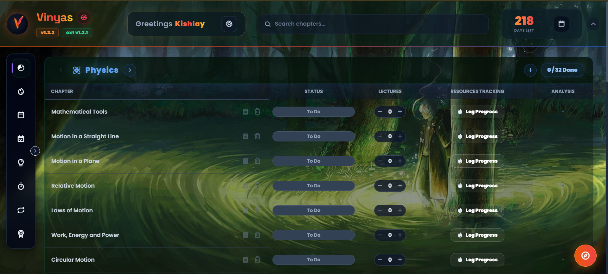
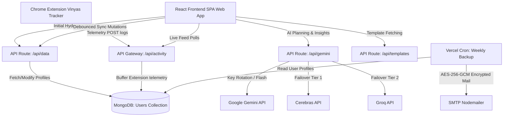

# <p align="center"> Vinyas</p>

<p align="center">
  <strong>A Gamified Syllabus Tracker, Real-Time Chrome Extension Companion, and AI-Powered Study Planner</strong>
</p>

<p align="center">
  
  
  
  
  
  
  
</p>

---



## 🌟 Overview

**Vinyas** is a state-of-the-art educational tracker designed for students mastering custom exam targets. Vinyas bridges the gap between passive learning and active tracking by automatically logging video lecture hours, Daily Practice Problem (DPP) scores, and textbook progress from external learning platforms (such as PhysicsWallah) via a custom-built Chrome Extension.

Equipped with a gamified study matrix, Pomodoro focus timers, spaced-repetition flashcards, daily planner workflows, an integrated diagnostics bug reporter, and automated encrypted email backups, Vinyas empowers students to optimize their prep with visual analytics, streaks, achievements, and intelligent AI assistance.

> **Live Demo**: [vinyas-one.vercel.app](https://vinyas-one.vercel.app)

---

## ✨ Features

### 🔗 Chrome Extension Interceptor
A lightweight Manifest V3 browser extension that seamlessly intercepts learning statistics—video watch sessions, textbook exercise layouts, and DPP accuracy—from PW platforms, syncing them in real-time to the MongoDB database. Features **1-Click Auto-Pair** with your dashboard for instant setup.

### 🏆 Gamified Dashboard
Features an XP-based leveling system, automatic study **streak tracking** with a visual calendar heatmap, a **Pomodoro focus timer**, **spaced-repetition revision scheduler**, customized daily goals, and unlockable achievements to keep students motivated.

### 📊 Interactive Syllabus Matrix
Tracks syllabus progress by subject, displaying chapter status (`Todo` | `Doing` | `Done`), personal log entries, DPP averages, and detailed progress/accuracy percentages on exercise modules. Includes a rich **Progress Modal** with per-DPP breakdowns and an interactive **Module Question Tracker**.

### 🧠 Syllabus Auto-Builder
Generates a comprehensive exam syllabus instantly from **server-hosted templates** (BITSAT, JEE, NEET, and more) or allows deep subject/chapter-level curation via a step-by-step setup wizard. No manual typing required—just select, customize, and go.

### 🤖 Intelligent AI Gateway
Features a **load-balanced API routing** system cycling through up to **20 Google Gemini API keys** with multi-level failover tiers to **Cerebras (GPT-OSS-120B)** and **Groq (Llama-3.3-70B)** in case of rate limits. Includes per-user rate limiting (15 req/min) and Sync ID authentication.

### 🐞 Diagnostics & Bug Reporter
Exposes a secure diagnostics panel and bug reporting tool. In case of issues, students can upload a description along with a screenshot (under 2MB). The system automatically packages OS specs, Sync IDs, and recent local logs into an AES-encrypted telemetry bundle, transmitting it securely to the developer via SMTP relay without ever storing the image or raw details on Vercel's server disk or inside MongoDB.

### 🛡️ Encrypted Auto-Backups
A robust **client-side encrypted** (AES-256-GCM + PBKDF2) automated weekly backup system via Vercel Cron that safely emails your entire syllabus database bundle to your inbox every Sunday. The mailed `.json` file is secure even if your email is compromised—decryption requires your private Sync ID.

### 🔒 Inactivity & Privacy Lifecycle
To preserve backend database resources and keep user profiles secure, Vinyas enforces a strict inactivity cleanup protocol calculated in the India Standard Time (IST) calendar timezone:
- **5-Day Inactivity Warning**: If a profile remains logged out for 5 calendar days, and an automated backup email was configured, a high-priority orange-alert warning email is sent.
- **6-Day Automatic Purge**: If a user is inactive for 6 consecutive calendar days, their profile is permanently deleted from MongoDB, and client session states (including extension local storage) are automatically reset.
- **Instant Activity Reset**: Performing any dashboard interaction (fetching data, logging study records, or syncing) immediately resets the inactivity tracker.

### 📱 Android Companion
Includes a compiled **Android APK** (`Vinyas.apk`) for study progress tracking directly on your mobile device.

### 📅 Daily Planner Workflows
Includes a **Morning Planner** for scheduling daily study tasks by subject, chapter, and template (Lecture, DPP, Revision), and a **Nightly Wrap-Up** workflow for logging completion, DPP scores, and notes before sleep. Suggested goals from PW upcoming events can be auto-imported.

### 🔍 Global Search
A fast overlay search system to instantly locate any chapter across all subjects in the syllabus matrix. Available via keyboard shortcut or header search bar.

### 🎨 Premium UI/UX
Designed using curated HSL dark-mode palettes, smooth gradients, subtle micro-animations, glassmorphism panels, **Outfit** font family, custom **Phosphor Icons**, and a premium Toast Notification interface with full-screen animated achievement celebrations.

### ⚙️ Session Settings
Control your sync profile with a rotating gear Settings menu supporting: **Export/Import** data (client-side encrypted JSON bundles), **Backup Settings** configuration, session **Logout** (which triggers local and browser extension storage cleanup), and permanent account **Delete**.

### 🔧 Developer Sandbox
A localhost-only **DevTools Overlay** panel for simulating DPP/Module submissions, testing inactivity alerts/purges, triggering achievement toast notifications, testing encrypted email dispatch, toggling log redaction bypass, and performing database operations.

---

## 🛠️ Architecture & Tech Stack

Vinyas operates as a premium React Single-Page Application (SPA) compiled with Vite, deploying serverless API routes on Vercel backed by a persistent MongoDB layer and automated SMTP email services.



### Stack Components
| Layer | Technology |
|---|---|
| **Frontend** | React 18, Vite 5, Vanilla CSS + TailwindCSS 3, Framer Motion, Phosphor Icons |
| **Backend** | Vercel Serverless Functions (Node.js) |
| **Database** | MongoDB Atlas |
| **AI Integration** | Gemini Flash (20-key rotation), Cerebras GPT-OSS-120B, Groq Llama-3.3-70B |
| **Encryption** | AES-256-GCM + PBKDF2 (Web Crypto API), RC4 telemetry obfuscation |
| **Email Service** | Nodemailer (SMTP), Vercel Cron Scheduler |
| **Extension** | Manifest V3 Chrome Extension (Service Worker + Content Scripts) |
| **Mobile** | Android APK |

---

## 📦 Project Structure

```text
Vinyas/
├── api/                           # Serverless Vercel API endpoints
│   ├── data.js                    # Core CRUD for user profiles & syllabus
│   ├── activity.js                # Chrome Extension telemetry buffer
│   ├── gemini.js                  # AI gateway with multi-key load balancing
│   ├── templates.js               # Exam syllabus template server
│   ├── achievements_config.js     # Achievement evaluation engine
│   ├── cron-backup.js             # Vercel Cron: weekly backups & inactivity checks
│   ├── test-backup-mail.js        # Manual backup email trigger
│   ├── telemetry.js               # Diagnostics telemetry endpoint
│   ├── logout.js                  # Session logout activity logger
│   ├── test-inactivity.js         # Developer inactivity simulation
│   ├── db.js                      # MongoDB connection pooling
│   ├── timezone.js                # IST timezone utility
│   └── shared/                    # Shared server utilities
│       ├── auth.js                # Sync ID authentication helpers
│       ├── email.js               # SMTP email dispatch utilities
│       └── syllabus.js            # Syllabus data processing helpers
├── src/                           # React frontend application
│   ├── components/                # 24 modular UI components
│   │   ├── Header.jsx             # Navigation, brand, diagnostics dropdown
│   │   ├── GamifiedDashboard.jsx  # XP, streaks, goals, activity feed
│   │   ├── SubjectTable.jsx       # Interactive syllabus progress matrix
│   │   ├── ProgressModal.jsx      # Detailed chapter progress modal
│   │   ├── ModuleQuestionTrackerModal.jsx  # Per-question exercise tracker
│   │   ├── PomodoroTimer.jsx      # Focus timer with break cycles
│   │   ├── SpacedRepetition.jsx   # Flashcard revision system
│   │   ├── StreakCalendar.jsx     # GitHub-style streak heatmap
│   │   ├── AchievementToast.jsx   # Full-screen celebration animations
│   │   ├── WhatsNewModal.jsx      # Version update changelog popup
│   │   ├── ProfileModal.jsx       # User profile editor
│   │   ├── ExtensionPage.jsx      # Extension download & tutorial hub
│   │   ├── CohortSetupModal.jsx   # Syllabus template builder wizard
│   │   ├── MorningPlannerModal.jsx    # Daily study plan creator
│   │   ├── NightlyWrapUpModal.jsx     # End-of-day logging workflow
│   │   ├── BackupSettingsModal.jsx    # Email backup configuration
│   │   ├── ResolveSubmissionsModal.jsx # Unmatched submission resolver
│   │   ├── ConfirmationModal.jsx  # Reusable confirmation dialog
│   │   ├── Modals.jsx             # Log, status & chapter edit modals
│   │   ├── StudyBuddyWidget.jsx   # AI study companion
│   │   ├── SearchOverlay.jsx      # Global chapter search
│   │   ├── FireSlider.jsx         # Animated fire intensity slider
│   │   ├── ToastContext.jsx       # Toast notification provider
│   │   └── DevToolsOverlay.jsx    # Developer testing sandbox
│   ├── services/                  # Client-side service layer
│   │   ├── crypto.js              # AES-256-GCM encryption (Web Crypto API)
│   │   ├── gemini.js              # AI client with attempt header parsing
│   │   ├── logger.js              # In-memory event logging bus
│   │   └── notifications.js       # Browser notification integration
│   ├── hooks/
│   │   └── useAchievements.js     # Achievement state management hook
│   ├── shared/                    # Shared frontend utilities
│   │   ├── normalize.js           # Data normalization helpers
│   │   └── time.js                # Time formatting utilities
│   ├── data/
│   │   ├── constants.jsx          # Initial syllabus, logo, chapter schema
│   │   ├── ai_instructions.js     # AI system prompt definitions
│   │   └── version.js             # App & extension version constants
│   ├── App.jsx                    # Root SPA lifecycle & state orchestrator
│   ├── index.css                  # Global design system & animations
│   └── main.jsx                   # DOM mounting with ToastContext provider
├── Vinyas_Extension/              # Manifest V3 Chrome Extension source
│   ├── manifest.json              # Extension manifest & permissions
│   ├── background.js              # Service worker for lifecycle management
│   ├── content_script.js          # PW page interceptor & data extraction
│   ├── dashboard_connector.js     # Auto-pair DOM query bridge
│   ├── popup.html                 # Extension popup UI
│   ├── popup.js                   # Extension popup logic & pairing controls
│   └── icon.svg                   # Extension icon
├── public/                        # Static assets served by Vite
│   ├── frontpage.png              # Dashboard screenshot for README
│   ├── Vinyas.apk                 # Android companion app
│   ├── Vinyas_Extension.zip       # Packaged extension download bundle
│   ├── favicon.ico                # Browser favicon
│   ├── icon.png / icon.svg        # App icons
│   ├── guide_*.png                # Extension setup tutorial images
│   ├── work_*.png                 # How-it-works illustrations
│   └── manifest.json              # PWA web manifest
├── templates/                     # Exam syllabus JSON templates
│   ├── bitsat.json                # BITSAT syllabus
│   ├── jee_mains.json             # JEE Mains syllabus
│   └── neet.json                  # NEET syllabus
├── vercel.json                    # Vercel config: routes, crons, functions
└── package.json                   # Dependencies & scripts
```

---

## ⚡ Getting Started

### Prerequisites
*   **Node.js** v18+
*   **MongoDB** instance (Atlas or local)
*   At least one **Google Gemini API Key** (optional: Cerebras or Groq keys for fallback)

### Local Installation

1.  **Clone the Repository**:
    ```bash
    git clone https://github.com/KISHLAY-AT-CODE/Vinyas.git
    cd Vinyas
    ```

2.  **Install Dependencies**:
    ```bash
    npm install
    ```

3.  **Environment Setup**:
    Create a `.env` file in the root directory:
    ```env
    MONGODB_URI=mongodb+srv://<username>:<password>@cluster.mongodb.net/vinyas?retryWrites=true&w=majority
    TELEMETRY_PASSWORD=your_secure_diagnostics_password

    # Gemini API Keys (supports up to 20 for load balancing)
    GEMINI_API_KEY_1=your_gemini_api_key_here
    GEMINI_API_KEY_2=your_second_key_here

    # Optional Fallback AI Providers
    GENERAL_API_KEY=gsk_your_groq_key_here
    CEREBRAS_API_KEY=csk_your_cerebras_key_here

    # Email Backup Service (optional)
    SMTP_USER=your_smtp_email@gmail.com
    SMTP_PASS=your_app_password
    ```

4.  **Run Development Server**:
    ```bash
    npm run dev
    # Or to run with Vercel serverless functions locally:
    npm run vercel-dev
    ```

5.  **Open in Browser**: Navigate to `http://localhost:5173` and create your Sync ID to get started.

---

## 🧩 Chrome Extension Setup

> **📸 Interactive Visual Tutorial**: Visit [vinyas-one.vercel.app/extension](https://vinyas-one.vercel.app/extension) for a step-by-step guided slideshow with annotated screenshots covering every installation step.

### Quick Setup Steps

1.  **Download** the extension ZIP bundle from the `/extension` page on your dashboard, or find `Vinyas_Extension/` in this repository.
2.  Open Chrome → navigate to `chrome://extensions/`.
3.  Enable **Developer mode** (top-right toggle).
4.  Click **Load unpacked** → select the extracted `Vinyas_Extension/` folder.
5.  **Pin** the extension to your Chrome toolbar via the puzzle icon.
6.  **1-Click Auto-Pair**: Open your active Vinyas dashboard tab, click the **Vinyas Tracker** extension icon, and hit **"Auto-Pair"**. The extension automatically detects your Sync ID and server URL.

### How It Works

Once paired, the extension silently monitors your study activity on PW platforms:

| What it Captures | How it Syncs |
|---|---|
| 📝 DPP quiz scores, accuracy, completion | Auto-posted to `/api/activity` on submission |
| 👑 Module/exercise completion metrics | Auto-posted with chapter matching |
| 🎥 Video lecture watch progress | Tracked via content script interception |
| 📚 Textbook exercise layouts | Extracts per-exercise question counts |

All captured data is **fuzzy-matched** to your syllabus chapters and auto-applied. Unmatched submissions appear in the **Resolve Submissions** modal for manual linking.

---

## 🔐 Security

Vinyas is designed with student privacy as a core priority:

*   **Cryptographic Sync IDs**: Generated using `crypto.getRandomValues()` with `vny_sec_` prefix (32 hex characters).
*   **AES-256-GCM Encryption**: All exported backups and email attachments are encrypted client-side using PBKDF2-derived keys (100,000 iterations). The server never sees plaintext backup data.
*   **Per-User Rate Limiting**: AI endpoints enforce 15 requests/minute per Sync ID.
*   **Sync ID Validation**: API routes verify secure prefix or database registration before processing.
*   **Diagnostics Redaction**: Live console logs automatically obfuscate Sync IDs and sensitive model data. Bypass available only in localhost DevTools.
*   **Content Security Policy**: Strict CSP headers in `index.html` restrict script and connection origins.

---

## 🏅 Achievements System

Achievements trigger premium **full-screen animated celebrations** with particle effects.

🤫 Discover achievements yourself!

---

## 📧 Automated Backups

Configure automated backups from **Settings → Backup Settings**:

1.  Enter your destination email address.
2.  Toggle **Weekly Auto-Backups** on.
3.  Every **Sunday at midnight UTC**, Vercel Cron automatically:
    - Fetches your latest profile from MongoDB
    - Encrypts the payload with AES-256-GCM using your Sync ID
    - Emails the encrypted `.json` bundle via SMTP
4.  To restore: Import the file via the **Import** button and supply your Sync ID for decryption.

---

## 🚀 Deployment

Vinyas is designed for **Vercel** deployment out of the box:

```bash
# Install Vercel CLI
npm i -g vercel

# Deploy
vercel --prod
```

Ensure all environment variables are configured in your Vercel project settings. The `vercel.json` handles SPA routing, serverless function bundling, and cron job scheduling automatically.

---

## 📅 Changelog

### v1.2.4 (May 28, 2026) - Latest Update
- 🎬 **Custom Loading Screen**: A beautiful branded loading animation with the Vinyas logo and an animated orange progress bar now appears while the app loads your data.
- ✨ **Pinned Action Buttons**: Save and Cancel buttons in all settings panels are now pinned at the bottom, so they are always accessible without scrolling.
- 🖼️ **Sharp & Custom Backdrops**: Uploaded background images now load crisp and clean by default, without any automatic blur or zoom.
- 🎨 **Drag to Position**: You can now click and drag your custom background image directly inside the settings preview to position it exactly how you want.
- ⚙️ **Smooth Fade & Blur**: Use the new opacity and blur sliders in the settings panel to customize the background style to your liking.

### v1.2.3 (May 28, 2026)
- 🐞 **Bug Report Button**: Added a quick-access bug report button right next to the Vinyas logo — tap it to report an issue, take a snapshot, or send feedback.
- 📚 **Custom Chapters**: You can now add your own chapters to any subject directly from the subject header.
- ✨ **Calmer Progress Animations**: Progress bar shine effects now only appear when you hover over a subject — no more constant flashing.
- 🔧 **Scrollbar Fix**: Removed a stray horizontal scrollbar that appeared on the syllabus page.
- 🎯 **Menus Stay Visible**: Pop-ups and dropdowns no longer get clipped — everything opens and displays fully.

### v1.2.2 (May 27, 2026)
- 👤 **Edit Your Profile**: You can now set a custom username that syncs across all your devices.
- 🎨 **New Logo Look**: The Vinyas logo now uses a premium gradient font style.
- 🔍 **Collapsible Search Bar**: The search bar in the header now collapses into an icon on smaller screens.
- 💾 **Backup Reminder**: A helpful backup prompt now appears after dismissing the What's New popup.

### v1.2.1 (May 26, 2026)
- 🔒 **Secure Login**: Your Sync ID is now used as a secure password for login.
- 📧 **Smarter Inactivity Alerts**: Inactivity countdowns now reset properly when you log back in.
- 🔄 **Duplicate Chapter Handling**: If two chapters share the same name, incoming study data is sent to a review queue instead of being lost.
- 🆕 **What's New Popup**: You'll now see a summary of new features whenever the app updates.
- 🚨 **Extension Warning**: A banner appears in the header if your Chrome extension is outdated.

### v1.2.0 (May 25, 2026)
- 🔄 **Duplicate Check on Sync**: A confirmation popup now asks whether to overwrite or skip when duplicate study results are detected.
- 🎨 **Empty State Illustrations**: Friendly "Nothing here yet" graphics for new sections before first use.
- 🔗 **Open in PW**: Quick-access buttons in your progress logs to jump directly to the DPP or Module on PhysicsWallah.
- 🎯 **Combined Study Goals**: Lecture and DPP goals are now merged into a single card with checkboxes.
- 📝 **Manual Module Tracking**: Track module completion and accuracy manually during nightly wrap-ups.
- 🐞 **Bug Reporter**: Report issues with a description and screenshot — everything is sent securely to the developer.
- ⏱️ **Inactivity Warnings**: Get notified after 5 days of inactivity; accounts are auto-deleted after 6 days to keep things tidy.

### v1.1.0 (May 10, 2026)
- 🔐 **Secure Sync IDs**: Your device now gets a unique, secure identifier for syncing.
- 📧 **Weekly Backups**: Set up automatic encrypted email backups of your study data.
- ⏱️ **Pomodoro Timer**: Focus timer with break cycles and XP rewards for study sessions.

### v1.0.0 (April 20, 2026)
- 🚀 **Initial Release**: The core syllabus tracker dashboard with gamification.
- 🔄 **Chrome Extension**: Companion browser extension to automatically track your study activity.

---

## 📄 License

This project is open source and available under the [MIT License](LICENSE).

---

<p align="center">
  <sub>Built with ❤️ for students, by students.</sub>
</p>
