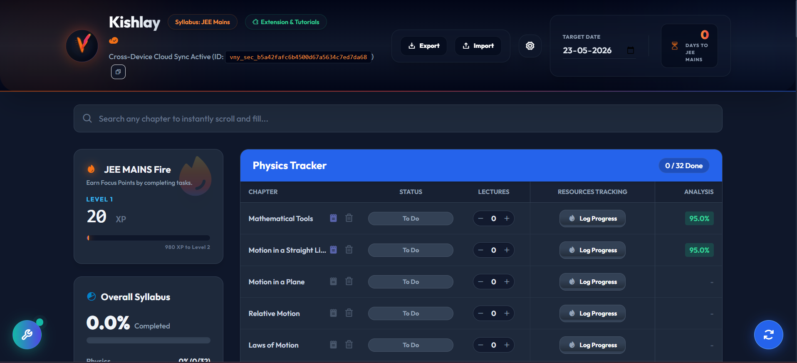
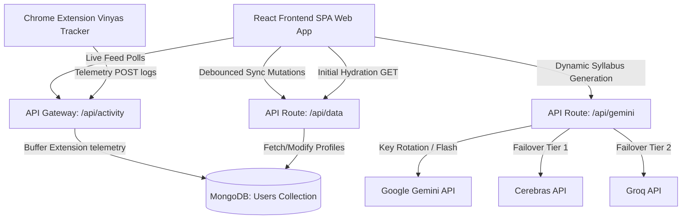

# <p align="center"> Vinyas</p>

<p align="center">
  <strong>A Gamified Syllabus Tracker, Educational Planner, and Real-Time Extension-Powered Study Companion</strong>
</p>

<p align="center">
  
  
  
  
  
  
</p>

---



## 🌟 Overview

**Vinyas** is a state-of-the-art educational tracker designed for students mastering custom exam targets. Vinyas bridges the gap between passive learning and active tracking by automatically logging video lecture hours, Daily Practice Problem (DPP) scores, and textbook progress from external learning platforms (such as PhysicsWallah) via a custom-built Chrome Extension. 

Equipped with a gamified study matrix, Pomodoro focus timers, spaced-repetition flashcards, syllabus builders, and a retro diagnostics terminal console, Vinyas empowers students to optimize their prep with visual analytics, streaks, and intelligent AI syllabus curation.

---

## ✨ Features

*   📺 **Chrome Interceptor**: A lightweight browser extension that seamlessly intercepts learning statistics, video watch sessions, book exercises, and DPP accuracy from PW platforms, syncing them in real-time to the database.
*   🏆 **Gamified Dashboard**: Features automatic study streaks, Pomodoro timers, spaced-repetition card decks, customized goals, and credentials/achievements to keep students motivated.
*   📊 **Interactive Syllabus Matrix**: Tracks syllabus progress by subject, displaying chapter status (`Todo` | `Doing` | `Done`), personal log entries, and detailed progress/accuracy percentages on textbooks and exercise modules.
*   🧠 **Syllabus Auto-Builder**: Instantly generates a comprehensive exam syllabus or extracts chapters directly from coaching planner PDFs utilizing local PDF parsers and AI prompts.
*   🤖 **Intelligent AI Gateway**: Features a load-balanced API routing system cycling through up to 20 Google Gemini API keys with multi-level fallbacks to Cerebras (GPT-OSS-120B) and Groq (Llama-3.3-70B) in case of rate limits.
*   📟 **Diagnostics Console**: An interactive terminal-like panel displaying live sync streams, Chrome Extension intercept feeds, database write logs, and security-redacted payload dumps.
*   🎨 **Premium UI/UX**: Designed using curated HSL dark-mode palettes, smooth gradients, subtle micro-animations, custom Phosphor icons, and a premium Toast Notification interface.
*   ⚙️ **Sleek Session Settings**: Control your sync profile with a rotating gear Settings menu to log out of your session or permanently reset/delete database profile entries in 1-click.

---

## 🛠️ Architecture & Tech Stack

Vinyas operates as a premium React Single-Page Application (SPA) compiled with Vite, deploying serverless API routes on Vercel backed by a persistent MongoDB layer.



### Stack Components
*   **Frontend**: React (v18), Vite, Vanilla CSS, TailwindCSS, Phosphor Icons
*   **Backend Hosting**: Vercel Serverless Functions (Node.js)
*   **Database**: MongoDB Atlas
*   **AI Integration**: Gemini Flash, Cerebras, Groq API client fallback
*   **Client Extension**: Manifest V3 Chrome Extension (Service Worker + Content Scripts)

---

## 📦 Project Structure

```text
Vinyas/
├── api/                    # Serverless Vercel endpoints
├── assets/                 # Brand assets & UI mockups
├── public/                 # Client static assets (SVG icons, global configuration)
├── src/                    # React frontend application
│   ├── components/         # Reusable dashboard widgets, tables, and modals
│   │   ├── ActivityConsole.jsx       # Terminal diagnostics console
│   │   ├── CohortSetupModal.jsx      # Syllabus Setup and customization modal
│   │   ├── GamifiedDashboard.jsx     # Spaced-rep, goals, pomodoro, achievements
│   │   └── SubjectTable.jsx          # Interactive syllabus progress board
│   ├── App.jsx             # Root SPA lifecycle & state orchestrator
│   └── main.jsx            # DOM mounting and Context provider injection
├── Vinyas_Extension/       # Manifest V3 Chrome Extension source
└── vercel.json             # Vercel serverless routing and SPA URL rewrites
```

---

## ⚡ Getting Started

### Prerequisites
*   Node.js (v18+)
*   MongoDB Instance (Atlas or local)
*   At least one Google Gemini API Key, Cerebras API Key, or Groq API Key

### Local Installation
1.  **Clone the Repository**:
    ```bash
    git clone https://github.com/yourusername/vinyas.git
    cd vinyas
    ```

2.  **Install Dependencies**:
    ```bash
    npm install
    ```

3.  **Environment Setup**:
    Create a `.env` file in the root directory:
    ```env
    MONGODB_URI=mongodb+srv://<username>:<password>@cluster.mongodb.net/vinyas?retryWrites=true&w=majority
    TELEMETRY_PASSWORD=your_secure_diagnostics_password
    GEMINI_API_KEY_1=your_gemini_api_key_here
    # Optional fallback keys
    CEREBRAS_API_KEY=your_cerebras_api_key_here
    GROQ_API_KEY=your_groq_api_key_here
    ```

4.  **Run Development Server**:
    ```bash
    npm run dev
    # Or to run with Vercel serverless functions locally:
    npm run vercel-dev
    ```

---

## 🧩 Chrome Extension Setup (1-Click Auto-Pair)

To start capturing your study progress automatically:

1.  Open Chrome and navigate to `chrome://extensions/`.
2.  Enable **Developer mode** (top-right toggle).
3.  Click **Load unpacked** (top-left).
4.  Select the `Vinyas_Extension/` folder from this repository directory.
5.  **1-Click Pairing**: Open your active Vinyas dashboard tab in your browser, click on the **Vinyas Tracker** extension icon, and select the **"Auto-Pair"** button. The extension will automatically detect your Sync ID, target exam target, and Vercel/Localhost Server URL and link up instantly!
