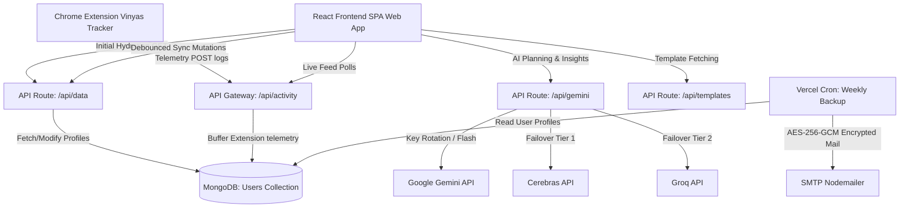

# <p align="center"> Vinyas</p>

<p align="center">
  <strong>A Gamified Syllabus Tracker, Real-Time Chrome Extension Companion, and AI-Powered Study Planner</strong>
</p>

<p align="center">
  
  
  
  
  
  
  
</p>

---


## 🌟 Overview

**Vinyas** is a state-of-the-art educational tracker designed for students mastering custom exam targets. Vinyas bridges the gap between passive learning and active tracking by automatically logging video lecture hours, Daily Practice Problem (DPP) scores, and textbook progress from external learning platforms (such as PhysicsWallah) via a custom-built Chrome Extension.

Equipped with a gamified study matrix, Pomodoro focus timers, spaced-repetition flashcards, daily planner workflows, a retro diagnostics terminal console, and automated encrypted email backups, Vinyas empowers students to optimize their prep with visual analytics, streaks, achievements, and intelligent AI assistance.

> **Live Demo**: [vinyas-one.vercel.app](https://vinyas-one.vercel.app)

---

## ✨ Features

### 🔗 Chrome Extension Interceptor
A lightweight Manifest V3 browser extension that seamlessly intercepts learning statistics—video watch sessions, textbook exercise layouts, and DPP accuracy—from PW platforms, syncing them in real-time to the MongoDB database. Features **1-Click Auto-Pair** with your dashboard for instant setup.

### 🏆 Gamified Dashboard
Features an XP-based leveling system, automatic study **streak tracking** with a visual calendar heatmap, a **Pomodoro focus timer**, **spaced-repetition revision scheduler**, customized daily goals, and unlockable achievements to keep students motivated.

### 📊 Interactive Syllabus Matrix
Tracks syllabus progress by subject, displaying chapter status (`Todo` | `Doing` | `Done`), personal log entries, DPP averages, and detailed progress/accuracy percentages on exercise modules. Includes a rich **Progress Modal** with per-DPP breakdowns and an interactive **Module Question Tracker**.

### 🧠 Syllabus Auto-Builder
Generates a comprehensive exam syllabus instantly from **server-hosted templates** (BITSAT, JEE, NEET, and more) or allows deep subject/chapter-level curation via a step-by-step setup wizard. No manual typing required—just select, customize, and go.

### 🤖 Intelligent AI Gateway
Features a **load-balanced API routing** system cycling through up to **20 Google Gemini API keys** with multi-level failover tiers to **Cerebras (GPT-OSS-120B)** and **Groq (Llama-3.3-70B)** in case of rate limits. Includes per-user rate limiting (15 req/min) and Sync ID authentication.

### 📟 Diagnostics Console
An interactive retro-terminal panel accessible at `/console`, displaying live sync streams, Chrome Extension intercept feeds, database write logs, and security-redacted payload dumps. Features real-time event logging with severity levels.

### 🐞 Diagnostics & Bug Reporter
Exposes a secure diagnostics panel and bug reporting tool. In case of issues, students can upload a description along with a screenshot (under 2MB). The system automatically packages OS specs, Sync IDs, and recent local logs into an AES-encrypted telemetry bundle, transmitting it securely to the developer via SMTP relay without ever storing the image or raw details on Vercel's server disk or inside MongoDB.

### 🛡️ Encrypted Auto-Backups
A robust **client-side encrypted** (AES-256-GCM + PBKDF2) automated weekly backup system via Vercel Cron that safely emails your entire syllabus database bundle to your inbox every Sunday. The mailed `.json` file is secure even if your email is compromised—decryption requires your private Sync ID.

### 🔒 Inactivity & Privacy Lifecycle
To preserve backend database resources and keep user profiles secure, Vinyas enforces a strict inactivity cleanup protocol calculated in the India Standard Time (IST) calendar timezone:
- **5-Day Inactivity Warning**: If a profile remains logged out for 5 calendar days, and an automated backup email was configured, a high-priority orange-alert warning email is sent.
- **6-Day Automatic Purge**: If a user is inactive for 6 consecutive calendar days, their profile is permanently deleted from MongoDB, and client session states (including extension local storage) are automatically reset.
- **Instant Activity Reset**: Performing any dashboard interaction (fetching data, logging study records, or syncing) immediately resets the inactivity tracker.

### 📱 Android Companion
Includes a compiled **Android APK** (`Vinyas.apk`) for study progress tracking directly on your mobile device.

### 📅 Daily Planner Workflows
Includes a **Morning Planner** for scheduling daily study tasks by subject, chapter, and template (Lecture, DPP, Revision), and a **Nightly Wrap-Up** workflow for logging completion, DPP scores, and notes before sleep. Suggested goals from PW upcoming events can be auto-imported.

### 🔍 Global Search
A fast overlay search system to instantly locate any chapter across all subjects in the syllabus matrix. Available via keyboard shortcut or header search bar.

### 🎨 Premium UI/UX
Designed using curated HSL dark-mode palettes, smooth gradients, subtle micro-animations, glassmorphism panels, **Outfit** font family, custom **Phosphor Icons**, and a premium Toast Notification interface with full-screen animated achievement celebrations.

### ⚙️ Session Settings
Control your sync profile with a rotating gear Settings menu supporting: **Export/Import** data (client-side encrypted JSON bundles), **Backup Settings** configuration, session **Logout** (which triggers local and browser extension storage cleanup), and permanent account **Delete**.

### 🔧 Developer Sandbox
A localhost-only **DevTools Overlay** panel for simulating DPP/Module submissions, testing inactivity alerts/purges, triggering achievement toast notifications, testing encrypted email dispatch, toggling log redaction bypass, and performing database operations.

---

## 🛠️ Architecture & Tech Stack

Vinyas operates as a premium React Single-Page Application (SPA) compiled with Vite, deploying serverless API routes on Vercel backed by a persistent MongoDB layer and automated SMTP email services.



### Stack Components
| Layer | Technology |
|---|---|
| **Frontend** | React 18, Vite 5, Vanilla CSS + TailwindCSS 3, Framer Motion, Phosphor Icons |
| **Backend** | Vercel Serverless Functions (Node.js) |
| **Database** | MongoDB Atlas |
| **AI Integration** | Gemini Flash (20-key rotation), Cerebras GPT-OSS-120B, Groq Llama-3.3-70B |
| **Encryption** | AES-256-GCM + PBKDF2 (Web Crypto API), RC4 telemetry obfuscation |
| **Email Service** | Nodemailer (SMTP), Vercel Cron Scheduler |
| **Extension** | Manifest V3 Chrome Extension (Service Worker + Content Scripts) |
| **Mobile** | Android APK |

---

## 📦 Project Structure

```text
Vinyas/
├── api/                        # Serverless Vercel API endpoints
│   ├── data.js                 # Core CRUD for user profiles & syllabus
│   ├── activity.js             # Chrome Extension telemetry buffer
│   ├── gemini.js               # AI gateway with multi-key load balancing
│   ├── templates.js            # Exam syllabus template server
│   ├── achievements_config.js  # Server-side achievement evaluation engine
│   ├── cron-backup.js          # Vercel Cron: weekly backups & inactivity checks
│   ├── test-backup-mail.js     # Manual backup email trigger
│   ├── telemetry.js            # Diagnostics console telemetry endpoint
│   ├── logout.js               # Session logout activity logger
│   ├── test-inactivity.js      # Developer inactivity simulation suite
│   ├── db.js                   # MongoDB connection pooling
│   └── timezone.js             # IST timezone utility
├── src/                        # React frontend application
│   ├── components/             # 23 modular UI components
│   │   ├── Header.jsx                  # Navigation, countdown, settings
│   │   ├── GamifiedDashboard.jsx       # XP, streaks, goals, activity feed
│   │   ├── SubjectTable.jsx            # Interactive syllabus progress matrix
│   │   ├── ProgressModal.jsx           # Detailed chapter progress modal
│   │   ├── ModuleQuestionTrackerModal.jsx  # Per-question exercise tracker
│   │   ├── PomodoroTimer.jsx           # Focus timer with break cycles
│   │   ├── SpacedRepetition.jsx        # Flashcard system
│   │   ├── StreakCalendar.jsx          # GitHub-style streak heatmap
│   │   ├── AchievementToast.jsx        # Full-screen celebration animations
│   │   ├── ActivityConsole.jsx         # Retro terminal diagnostics
│   │   ├── ExtensionPage.jsx           # Extension download & tutorial hub
│   │   ├── CohortSetupModal.jsx        # Syllabus template builder wizard
│   │   ├── MorningPlannerModal.jsx     # Daily study plan creator
│   │   ├── NightlyWrapUpModal.jsx      # End-of-day logging workflow
│   │   ├── BackupSettingsModal.jsx     # Email backup configuration
│   │   ├── ResolveSubmissionsModal.jsx # Unmatched submission resolver
│   │   ├── StudyBuddyWidget.jsx        # AI study companion
│   │   ├── SearchOverlay.jsx           # Global chapter search
│   │   ├── DevToolsOverlay.jsx         # Developer testing sandbox
│   │   └── ...                         # Modals, context, fire slider
│   ├── services/               # Client-side service layer
│   │   ├── crypto.js           # AES-256-GCM encryption (Web Crypto API)
│   │   ├── gemini.js           # AI client with attempt header parsing
│   │   ├── logger.js           # In-memory event logging bus
│   │   └── notifications.js    # Browser notification integration
│   ├── hooks/
│   │   └── useAchievements.js  # Achievement state management hook
│   ├── data/
│   │   ├── constants.jsx       # Initial syllabus, logo, chapter schema
│   │   └── ai_instructions.js  # AI system prompt definitions
│   ├── App.jsx                 # Root SPA lifecycle & state orchestrator
│   ├── index.css               # Global design system & animations
│   └── main.jsx                # DOM mounting with ToastContext provider
├── Vinyas_Extension/           # Manifest V3 Chrome Extension source
│   ├── manifest.json           # Extension manifest & permissions
│   ├── background.js           # Service worker for lifecycle management
│   ├── content_script.js       # PW page interceptor & data extraction
│   ├── dashboard_connector.js  # Auto-pair DOM query bridge
│   ├── popup.html / popup.js   # Extension popup UI & pairing controls
│   └── icon.svg                # Extension icon
├── templates/                  # Exam syllabus JSON templates (BITSAT, JEE, etc.)
├── Vinyas.apk                  # Compiled Android companion app
├── vercel.json                 # Vercel config: routes, crons, function bundling
└── package.json                # Dependencies & scripts
```

---

## ⚡ Getting Started

### Prerequisites
*   **Node.js** v18+
*   **MongoDB** instance (Atlas or local)
*   At least one **Google Gemini API Key** (optional: Cerebras or Groq keys for fallback)

### Local Installation

1.  **Clone the Repository**:
    ```bash
    git clone https://github.com/KISHLAY-AT-CODE/Vinyas.git
    cd Vinyas
    ```

2.  **Install Dependencies**:
    ```bash
    npm install
    ```

3.  **Environment Setup**:
    Create a `.env` file in the root directory:
    ```env
    MONGODB_URI=mongodb+srv://<username>:<password>@cluster.mongodb.net/vinyas?retryWrites=true&w=majority
    TELEMETRY_PASSWORD=your_secure_diagnostics_password

    # Gemini API Keys (supports up to 20 for load balancing)
    GEMINI_API_KEY_1=your_gemini_api_key_here
    GEMINI_API_KEY_2=your_second_key_here

    # Optional Fallback AI Providers
    GENERAL_API_KEY=gsk_your_groq_key_here
    CEREBRAS_API_KEY=csk_your_cerebras_key_here

    # Email Backup Service (optional)
    SMTP_USER=your_smtp_email@gmail.com
    SMTP_PASS=your_app_password
    ```

4.  **Run Development Server**:
    ```bash
    npm run dev
    # Or to run with Vercel serverless functions locally:
    npm run vercel-dev
    ```

5.  **Open in Browser**: Navigate to `http://localhost:5173` and create your Sync ID to get started.

---

## 🧩 Chrome Extension Setup

> **📸 Interactive Visual Tutorial**: Visit [vinyas-one.vercel.app/extension](https://vinyas-one.vercel.app/extension) for a step-by-step guided slideshow with annotated screenshots covering every installation step.

### Quick Setup Steps

1.  **Download** the extension ZIP bundle from the `/extension` page on your dashboard, or find `Vinyas_Extension/` in this repository.
2.  Open Chrome → navigate to `chrome://extensions/`.
3.  Enable **Developer mode** (top-right toggle).
4.  Click **Load unpacked** → select the extracted `Vinyas_Extension/` folder.
5.  **Pin** the extension to your Chrome toolbar via the puzzle icon.
6.  **1-Click Auto-Pair**: Open your active Vinyas dashboard tab, click the **Vinyas Tracker** extension icon, and hit **"Auto-Pair"**. The extension automatically detects your Sync ID and server URL.

### How It Works

Once paired, the extension silently monitors your study activity on PW platforms:

| What it Captures | How it Syncs |
|---|---|
| 📝 DPP quiz scores, accuracy, completion | Auto-posted to `/api/activity` on submission |
| 👑 Module/exercise completion metrics | Auto-posted with chapter matching |
| 🎥 Video lecture watch progress | Tracked via content script interception |
| 📚 Textbook exercise layouts | Extracts per-exercise question counts |

All captured data is **fuzzy-matched** to your syllabus chapters and auto-applied. Unmatched submissions appear in the **Resolve Submissions** modal for manual linking.

---

## 🔐 Security

Vinyas is designed with student privacy as a core priority:

*   **Cryptographic Sync IDs**: Generated using `crypto.getRandomValues()` with `vny_sec_` prefix (32 hex characters).
*   **AES-256-GCM Encryption**: All exported backups and email attachments are encrypted client-side using PBKDF2-derived keys (100,000 iterations). The server never sees plaintext backup data.
*   **Per-User Rate Limiting**: AI endpoints enforce 15 requests/minute per Sync ID.
*   **Sync ID Validation**: API routes verify secure prefix or database registration before processing.
*   **Diagnostics Redaction**: Live console logs automatically obfuscate Sync IDs and sensitive model data. Bypass available only in localhost DevTools.
*   **Content Security Policy**: Strict CSP headers in `index.html` restrict script and connection origins.

---

## 🏅 Achievements System

Achievements trigger premium **full-screen animated celebrations** with particle effects.

🤫 Discover achievements yourself!

---

## 📧 Automated Backups

Configure automated backups from **Settings → Backup Settings**:

1.  Enter your destination email address.
2.  Toggle **Weekly Auto-Backups** on.
3.  Every **Sunday at midnight UTC**, Vercel Cron automatically:
    - Fetches your latest profile from MongoDB
    - Encrypts the payload with AES-256-GCM using your Sync ID
    - Emails the encrypted `.json` bundle via SMTP
4.  To restore: Import the file via the **Import** button and supply your Sync ID for decryption.

---

## 🚀 Deployment

Vinyas is designed for **Vercel** deployment out of the box:

```bash
# Install Vercel CLI
npm i -g vercel

# Deploy
vercel --prod
```

Ensure all environment variables are configured in your Vercel project settings. The `vercel.json` handles SPA routing, serverless function bundling, and cron job scheduling automatically.

---

## 📅 Changelog

### v1.2.1 (May 26, 2026) - Latest Update
- 🔒 **Secured Sync ID Login**: Configured credentials load system utilizing Sync ID as secure password verification.
- 📧 **Inactivity Warning Fixes**: Cancel active profile warning countdowns on user logins, resetting inactivity limits.
- 🔄 **Duplicate Chapter Resolver**: Reroute study telemetry to unresolved queues if duplicate chapter names are matched.
- 🆕 **What's New Popup**: Automatically alerts users of version updates on loading the dashboard.
- 🚨 **Pinned Extension Warning**: Pinned a persistent warning banner in the app header if outdated browser extensions are active.

### v1.2.0 (May 25, 2026)
- 🔄 **Link-Based Sync Re-Check**: Implemented duplicate overlay asking for confirmation to bypass deduplication or cancel when parsing study results.
- 🎨 **Empty States**: Created "Nothing to see here" empty state illustration for interactive module question tracker prior to first synced practice.
- 🔗 **Direct PW Shortcuts**: Added "Open PW" shortcut button in progress logs allowing direct navigation to PhysicsWallah specific DPPs or Modules.
- 🎯 **Consolidated Suggested Goals**: Lecture & DPP recommendations are merged into a single card with multi-select checklists and stable goal identifiers.
- 📝 **Manual Module Tracking**: Added native manual module tracking (completion/accuracy sliders) within wrap-ups, syncing directly to database.
- 🐞 **Developer Telemetry**: Added premium Contact Developer & secure AES-encrypted diagnostics Bug Reporter console.
- 📸 **Screenshot Attachments**: Support for base64 screenshot attachments (under 2MB) in bug reports, forwarded securely to developer mail via server-side SMTP relay.
- 🔒 **Privacy & Storage Purge**: Complete `localStorage` and extension `chrome.storage.local` atomic cleanup on session logout or account deletion.
- ⏱️ **IST Inactivity Lifecycle**: Added 5-day inactivity warning alerts and 6-day automatic account deletion/purges calculated precisely in the Asia/Kolkata (IST) calendar day timezone.

### v1.1.0 (May 10, 2026)
- 🔐 **Secure Cryptographic Sync IDs**: Configured high-entropy device synchronization identifiers (`vny_sec_`).
- 📧 **Automated Database Backups**: Added configuration options for automated weekly backups with developer diagnostic email testing tools.
- ⏱️ **Pomodoro Session Logger**: Integrated client-side Pomodoro focus minutes logs with scaling XP rewards.

### v1.0.0 (April 20, 2026)
- 🚀 **Initial Beta Release**: Core gamified syllabus organizing matrix dashboard.
- 🔄 **Auto-Sync Telemetry**: MV3 companion Chrome extension for automatic student practice data intercept.

---

## 📄 License

This project is open source and available under the [MIT License](LICENSE).

---

<p align="center">
  <sub>Built with ❤️ for students, by students.</sub>
</p>
